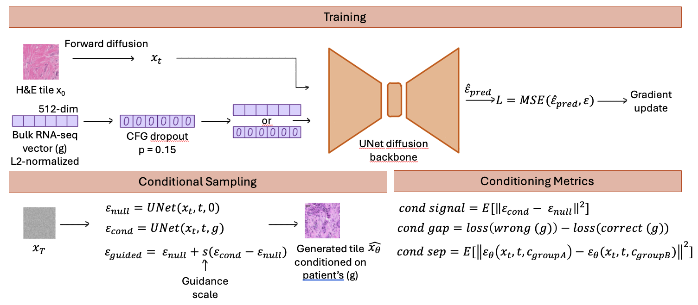
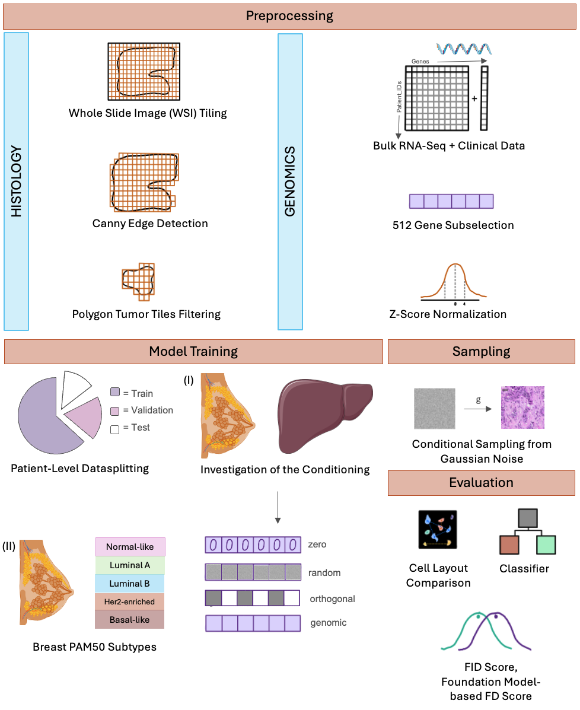

# Master-Thesis-Repository

This repository contains code for my Master Thesis entitled "Reconstructing histological images from genomic data using diffusion models".

## Table of Contents

- [Project Description](#project-description)
- [Project Structure](#project-structure)
- [Getting Started](#getting-started)
  - [Prerequisites](#prerequisites)
  - [Installation](#installation)
- [Dataset](#dataset)
- [Schematics](#schematics)
- [Main Experiments](#main-experiments)
- [Building on the following Work](#building-on-the-following-work)

## Project Description

This thesis investigates whether bulk RNA-seq gene expression profiles can guide a diffusion model to generate realistic, subtype-specific H&E histology tiles. The target dataset is TCGA-BRCA with PAM50 molecular subtypes (Basal, LumA, LumB, Her2, Normal).

The diffusion model framework is inspired by [mopadi](https://github.com/KatherLab/mopadi)'s UNet architecture which was built on a [DiffAE](https://github.com/konpatp/diffae). Genomic conditioning is injected via the model's FiLM-style AdaGN mechanism. Also, Classifier-Free Guidance (CFG) is utilized.



## Project Structure

```
Master-Thesis-Repository/
├── src/                                   
│   ├── config.yaml                        # Central pipeline configuration
│   ├── preprocessing/                     
│   ├── encoding/                          # Genomic encoding 
│   ├── model_training/                    # CFG-based training
│   ├── reconstruction/                    # From random-noise
│   ├── evaluation/                        # FID and tile generation eval
│   ├── quality_assurance/                 # Reconstruction metrics and TopoFD
│   ├── visualization/                     # Plotting utilities
│   ├── classifier/                        # Subtype classification 
│   ├── statistics/                        # Dataset/training-statistics analysis
│   ├── utils/                             # Shared helper utilities
│   └── drafts/                            # Archived experiments
├── slurm/                                 # slurm jobs submission scripts
├── notebooks/                             # Analysis notebooks
├── tests/                                 # Unit tests
├── run_pipeline.py                        # Main orchestration CLI
├── pyproject.toml                         # Project metadata and dependencies
└── README.md
```

## Getting Started

### Prerequisites
- Python 3.11+
- [uv](https://docs.astral.sh/uv/) package manager

### Installation

```bash
# Clone the repository
git clone https://github.com/marabuuu/Master-Thesis-Repository.git && cd Master-Thesis-Repository

# Install all dependencies
uv sync 

# Activate environment
source .venv/bin/activate
```

## Dataset

[TCGA](https://www.cancer.gov/tcga)'s digital histopathology WSIs, together with the corresponding bulk RNA-seq and clinical data, are available at [Genomic Data Commons](https://portal.gdc.cancer.gov/) and [cBioPortal](https://cbioportal.org).

## Main Experiments

### 1. 128px Conditioning Investigation (TCGA-BRCA vs TCGA-LIHC)
To understand how the implementation behaves using different conditioning signals, zero, randomly initialized, orthogonal, and real genomic conditioning were compared at 128×128px on a breast-vs-liver cohort.

### 2. Breast Cancer PAM50 Subtype Experiment
The implementation was then applied to the main task: 5-class PAM50 subtype conditioning on the TCGA-BRCA cohort at 256×256px. Tiles are generated by conditional sampling from Gaussian noise and only the Luminal A and Basal like subtypes were used for evaluation.



## Building on the following Work

This repository reuses and builds on external projects. Credit is listed here and
also inline in relevant source modules.

- **mopadi** (KatherLab/mopadi):
	- Repository: https://github.com/KatherLab/mopadi
	- The active model training pipeline (`src/model_training/`) is built on top of
		mopadi's diffusion infrastructure: `LitModel`, `ema`, `TrainConfig`, and the
		`BeatGANsAutoencModel` UNet are imported directly and extended.
	- Preprocessing utilities were adapted from mopadi data-prep scripts in:
		- `src/preprocessing/get_tiles_within_rois.py`
		- `src/preprocessing/utils.py`

- **DiffAE** (konpatp/diffae), MIT license:
	- Repository: https://github.com/konpatp/diffae
	- Transitive dependency via mopadi: the UNet architecture and FiLM-style AdaGN
		conditioning mechanism that mopadi (and therefore this repository's
		`src/model_training/`) build on originate from DiffAE.

- **TopoCellGen** (Melon-Xu/TopoCellGen):
	- Repository: https://github.com/Melon-Xu/TopoCellGen
	- Topological Fréchet Distance implementation in
		`src/quality_assurance/topological_frechet_distance.py` is inspired by
		TopoCellGen's `eval_TopoFD` approach.

- **DeepCMorph** (aiff22/DeepCMorph), CC BY-NC-SA 4.0:
	- Repository: https://github.com/aiff22/DeepCMorph
	- `src/classifier/segment_and_classify_cells.py` and the TFD cell-segmentation
		pipeline (`src/quality_assurance/segment_and_compute_topofd.py`) depend on
		DeepCMorph at runtime for nuclei segmentation and classification. No
		DeepCMorph code or pretrained weights are bundled in this repository. It
		must be cloned separately and its checkpoints obtained independently.
	- This repository's own code remains MIT-licensed, but these specific modules
		are only usable non-commercially in practice, since they require a
		separately obtained DeepCMorph installation and are subject to its
		NonCommercial-ShareAlike terms.

## Hardware 

For the investigation of the conditioning experiment, 4 NVIDIA A100-SXM4 GPUs with 80 GB of memory each were used. These resources were provided by Kather Lab internal
slurm cluster. For the breast PAM50 subtype experiment, 4 NVIDIA H100 GPUs with 80 GB of memory each were used on [High-Performance Computing (HPC) system and
services provided at TU Dresden/ZIH](https://compendium.hpc.tu-dresden.de).


For questions or contributions, please open an issue or pull request!

