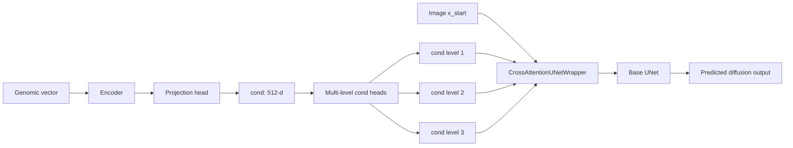
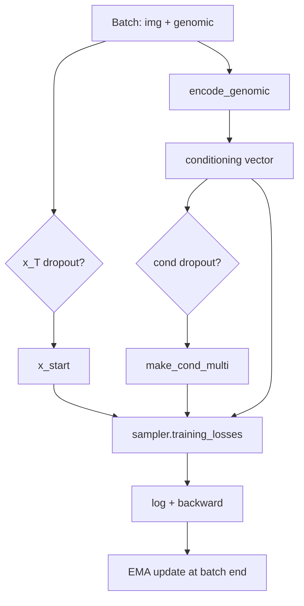

# Cross-Attention Joint Training

This module is a small variant of the existing `joint_training` pipeline.
It keeps most of the original training stack, but replaces the diffusion UNet with a cross-attention wrapper so genomic conditioning is injected more explicitly.

## What this module does

- Reuses `JointLitModel` from `src/joint_training/model.py`.
- Wraps the base UNet with `CrossAttentionUNetWrapper`.
- Adds robustness tricks in training:
  - image-path dropout (`xT_dropout_prob`),
  - full conditioning dropout (`cond_dropout_prob`),
  - feature-level conditioning dropout (`cond_feature_dropout`).
- Keeps Lightning trainer flow and checkpointing logic in `train.py`.

## High-level architecture

## Training step (simplified)

## Core files

- `model.py`
  - `CrossAttentionBlock`: attention from image tokens to one conditioning token.
  - `CrossAttentionUNetWrapper`: applies cross-attention residuals at multiple scales, then calls base UNet.
  - `CrossAttentionJointLitModel`: extends `JointLitModel`, swaps in wrapped UNet, and customizes `training_step`.
- `train.py`
  - Entry point (`python src/cross_attention_joint_training/train.py --config src/config.yaml`).
  - Builds trainer, checkpoint callback, logger, and launches fit.

## Key config knobs (from `joint_training` section)

- Cross-attention structure:
  - `cross_attention.heads`
  - `cross_attention.dim_per_head`
  - `cross_attention.cond_dims`
- Robustness/dropout:
  - `xT_dropout_prob`
  - `cond_dropout_prob`
  - `cond_feature_dropout`
- Validation cost controls:
  - `val_check_interval`
  - `limit_val_batches`
  - `val_batch_size`, `val_num_workers`

## Why this variant exists

The baseline joint setup already conditions diffusion on genomics. This variant strengthens that coupling by injecting conditioning at multiple levels through cross-attention, while using dropout-based regularization so the model cannot rely only on one pathway.
