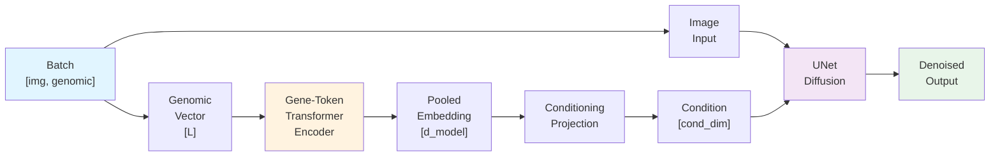
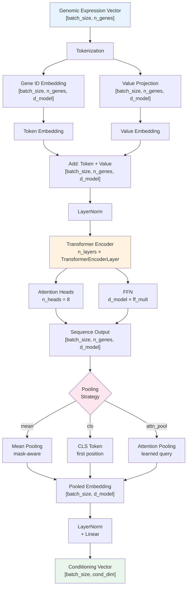
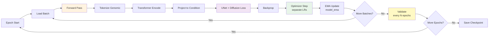

# Gene-Token Transformer Joint Training

**A transformer-based genomic encoder for diffusion-based RNA-to-WSI image synthesis.**

This variant replaces the probabilistic VAE encoder with a **transformer encoder** that processes gene expression as a sequence of tokens, enabling better modeling of gene interactions for improved image conditioning.

## Overview

Gene-token transformer joint training combines:
- **Deterministic tokenization** of bulk RNA expression data
- **Transformer encoder** that learns contextual gene representations
- **Pooled conditioning** for injection into a diffusion UNet
- **Joint training** with mopadi-style diffusion for end-to-end optimization

The architecture stays compatible with existing diffusion pipelines while replacing only the genomic encoder component.

## External References and Credits

- **mopadi** (https://github.com/KatherLab/mopadi):
  this training variant reuses the local `joint_training` stack, which itself
  builds on mopadi diffusion training components.
- **Bulk-RNA-BERT** (https://github.com/multiomics-open-research/Bulk-RNA-Bert):
  this module is architecturally inspired by gene-token transformer ideas from
  Bulk-RNA-BERT-style modeling.
- Current status for this folder: no direct code import from Bulk-RNA-BERT;
  inspiration is conceptual/architectural.

## Architecture

### Data Flow



### Transformer Encoder Architecture



## Component Details

### 1. Tokenization (`tokenizer.py`)

Converts dense expression vectors into deterministic token sequences:

```python
GeneExpressionTokenizer
├── gene_names: tuple[str, ...]  # Fixed gene vocabulary
└── tokenize(genomic: [L]) → {
    ├── gene_ids: [L]              # 0, 1, 2, ..., L-1
    ├── gene_values: [L]           # expression levels
    └── attention_mask: [L]        # all ones (no masking yet)
}
```

**Key properties:**
- **Deterministic:** same gene order for all samples
- **Efficient:** precomputed, cached gene IDs
- **Flexible:** supports optional truncation via `seq_len`

### 2. Transformer Encoder (`model.py` → `GeneTokenTransformerEncoder`)

Stack of transformer layers processing tokenized genes:

```
Input: [batch_size, seq_len, d_model]
  ↓
TransformerEncoder (n_layers=4)
  • MultiHeadAttention (n_heads=8)
  • FeedForward (ff_mult=4)
  • Dropout, LayerNorm, residuals
  ↓
Output (sequence): [batch_size, seq_len, d_model]
  ↓
Pooling (mean/cls/attn_pool)
  ↓
Pooled: [batch_size, d_model]
```

**Configuration parameters:**
- `d_model`: hidden dimension (256)
- `n_heads`: attention heads (8)
- `n_layers`: transformer layers (4)
- `ff_mult`: FFN expansion factor (4)
- `dropout`: regular dropout (0.1)
- `pooling`: aggregation strategy ("mean", "cls", or "attn_pool")

### 3. Conditioning Projection

Two-layer MLP that projects pooled embeddings to UNet condition space:

```python
cond_projection = Sequential(
    LayerNorm(d_model=256),
    Linear(256 → cond_dim=512)
)
```

Maps transformer output to standard conditioning dimension for diffusion UNet.

### 4. Dataset Wrapper (`dataset.py`)

Augments existing `GenomicTileDataset` with tokenized fields:

```python
GeneTokenizedGenomicTileDataset(base_dataset, tokenizer)
  └── Wraps: GenomicTileDataset
      └── Returns: {
          **base_item,  # img, genomic, split, etc.
          "gene_ids": [...],
          "gene_values": [...],
          "attention_mask": [...]
      }
```

## Training Loop



## Configuration

Add to `config.yaml` under `gene_token_transformer_joint_training`:

```yaml
gene_token_transformer_joint_training:
  # Tokenization
  seq_len: null                    # truncate to N genes (null = all)
  value_embedding: "mlp"           # mlp | bins (currently mlp only)

  # Transformer architecture
  d_model: 256                     # hidden dimension
  n_heads: 8                       # attention heads
  n_layers: 4                      # encoder layers
  ff_mult: 4                       # FFN expansion
  dropout: 0.1                     # dropout rate
  
  # Pooling and projection
  pooling: "mean"                  # cls | mean | attn_pool
  cond_dim: 512                    # output conditioning dimension
  
  # Optimization
  freeze_transformer_steps: 0      # freeze encoder for N steps
  transformer_lr: 1.0e-4           # encoder learning rate

  # Diffusion/training (inherited from base config)
  batch_size: 2
  epochs: 100
  gpus: [0]
  ...
```

## Training Phases

### Phase 1: **Baseline Joint Training** ✅ Complete

- Basic transformer encoder + projection
- Joint end-to-end training with diffusion loss
- No freezing, single LR across all components
- **Status:** Smoke tested (20 steps successful)

### Phase 2: Stability Enhancements

- Multi-scale learning rates (separate LRs for transformer/projection/UNet)
- Optional encoder freezing during warmup
- Gradient checkpointing for memory efficiency

### Phase 3: Validation & Ablations

- Gene subset selection (top genes by variance)
- Pooling strategy comparison (cls vs mean vs attn_pool)
- Expression value embedding variants

### Phase 4: Cross-Attention Integration

- Multi-scale conditioning outputs (`cond_multi`) for hierarchical UNet conditioning
- Specialized transformer encoder outputs at multiple scales

### Phase 5: Pre-training & Fine-tuning

- Optional external pretraining on RNA-seq datasets
- Layer-freezing strategies for transfer learning

## Design Decisions

### Why Transformer Encoder?

1. **Captures gene interactions:** self-attention layers learn contextual relationships between genes beyond simple linear combinations
2. **Scalable:** can handle 20k+ genes efficiently with sequence-level processing
3. **Flexible:** architecture supports gradient masks, layer freezing, and hierarchical outputs
4. **Proven:** Bulk-RNA-BERT and related models show strong RNA→phenotype prediction

### Why Deterministic Tokenization?

- **Stability:** fixed gene order ensures reproducible conditioning across runs
- **Efficiency:** precomputed token IDs, no per-sample computation
- **Simplicity:** avoids learned vocabulary overhead, focuses on expression modeling
- **Ablation:** easy to test subsets of genes by truncating sequences

### Why Pooling?

Three strategies supported:
- **Mean pooling:** robust to sequence length, mask-aware weighting
- **CLS token:** standard BERT-style approach, requires no special logic
- **Attention pooling:** learned aggregation with multihead attention (most expressive)

## Module Statistics

From initialization logging:

```
[GeneTokenJoint] Encoder: ~500K params
[GeneTokenJoint] Proj: ~300K params  
[GeneTokenJoint] UNet: ~120M params
[GeneTokenJoint] Total: ~120M params
```

Transformer encoder is ~0.5% of total model: minimal memory/compute overhead while providing rich conditioning signal.

## Running Training

```bash
# Full 100-epoch training
sbatch slurm/gene_token_transformer.sh

# Or directly:
python src/gene_token_transformer_joint_training/train.py \
  --config src/config.yaml
```

**Configuration location:** `config.yaml` → `gene_token_transformer_joint_training` section

**Logs:** TensorBoard in experiment directory
- Loss curves (train vs validation)
- Learning rate schedule
- Sample visualizations
- Checkpoints every `save_every_samples`

## Known Limitations & Future Work

| Limitation | Status | Mitigation |
|-----------|--------|-----------|
| Single pooling per encoder | Open | Phase 4: multi-scale outputs |
| No layer freezing | Open | Phase 2: add `freeze_transformer_steps` |
| No value discretization | Phase 3 | Optional `bins` embedding mode |
| No pre-training | Open | Phase 5: external RNA model init |
| Gene subset fixed at init | Phase 3 | Learned top-k selection |

## Testing & Validation

**Smoke test** (20 steps):
```bash
# Quick validation of architecture correctness
python src/gene_token_transformer_joint_training/train.py \
  --config=tests/smoke_config.yaml
```

Expected: model initializes correctly, forward passes complete, losses decrease slightly.

**Full training** (100 epochs):
```bash
# Production run on full dataset
sbatch slurm/gene_token_transformer.sh
```

**Convergence checks:**
- Training loss monotonically decreases per epoch
- Validation loss tracks training loss
- Sample quality improves visually
- Learning rate schedule follows cosine annealing decay

## API Compatibility

This variant inherits from `JointLitModel` and maintains full compatibility:

```python
model = GeneTokenTransformerJointLitModel(conf, joint_cfg, n_genes=20000)

# Standard interface:
cond = model.encode_genomic(genomic_vector)  # [batch, cond_dim]
loss = model.training_step(batch, batch_idx)
samples = model.sample(num_samples=4, cond=cond)
```

Conditioning can be used with:
- Plain diffusion UNet (current)
- Cross-attention UNet (Phase 4)
- Future variants (hierarchical, multi-modal)
